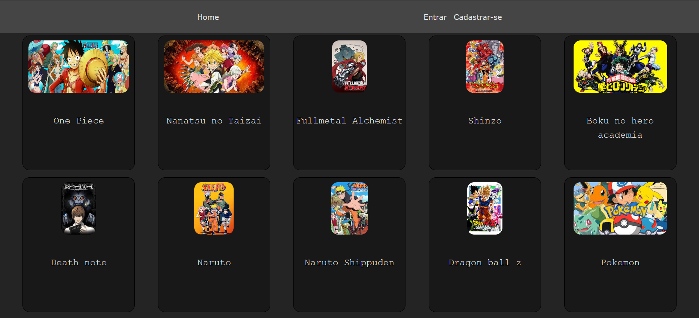

# 📽️ Anime-Flex 🎞️



<h3>Anime-Flex é uma aplicação web para que você possa assistir seus animes</h3>

### 👤👥 **Papéis ou tipos de usuário da aplicação**

- Administrador
- Membro
- Usuário não logado

### 🗓️📅**Entidades ou tabelas do sistema**

- Lista de Administradores
- Lista contendo os vídeos
- Lista de Membros
- Lista de Comentários
- Lista de Favoritos

### 📑📈⚙️ **Principais funcionalidades da aplicação**

- Administrador
    - Cadastrar Animes novos
    - Remover Animes já cadastrados
    - Atualizar informações dos Animes cadastrados
    - Excluir comentários
    - Adicionar novo administrador
    - Remover administrador cadastrado
    - Remover Membros
- Membro
    - Assistir animes
    - Favoritar Animes
    - Criar comentários
    - Editar comentários
    - Excluir comentários
    - Descadastrar-se como membro
- Usuário não logado
    - Assistir animes
    - Ler Comentários
    - Cadastrar-se como membro# 📽️ Anime-Flex 🎞️

## Tecnologias utilizadas


## Como usar em Desenvolvimento

- ATENÇÂO. Este projeto é apenas O Front-End de uma aplicação completa, para acessar o repositório do Back-End [clique aqui](https://github.com/Matheus-Rodrigues-EC/Anime-Flex-Node.js).

1. Clone este repositório
2. Entre na pasta criada `Anime-Flex-Vue.js`
3. Instale todas as dependências com o comando
```bash
    npm install
```
4. Crie um arquivo `.env` e configure a variável de ambiente `VITE_BASE_URL` como o link do seu back-end
5. Para rodar em desenvolvimento utilize o comando
```bash
    npm run dev
```
6. para construir a aplicação utilize
```bash
    npm run build
```